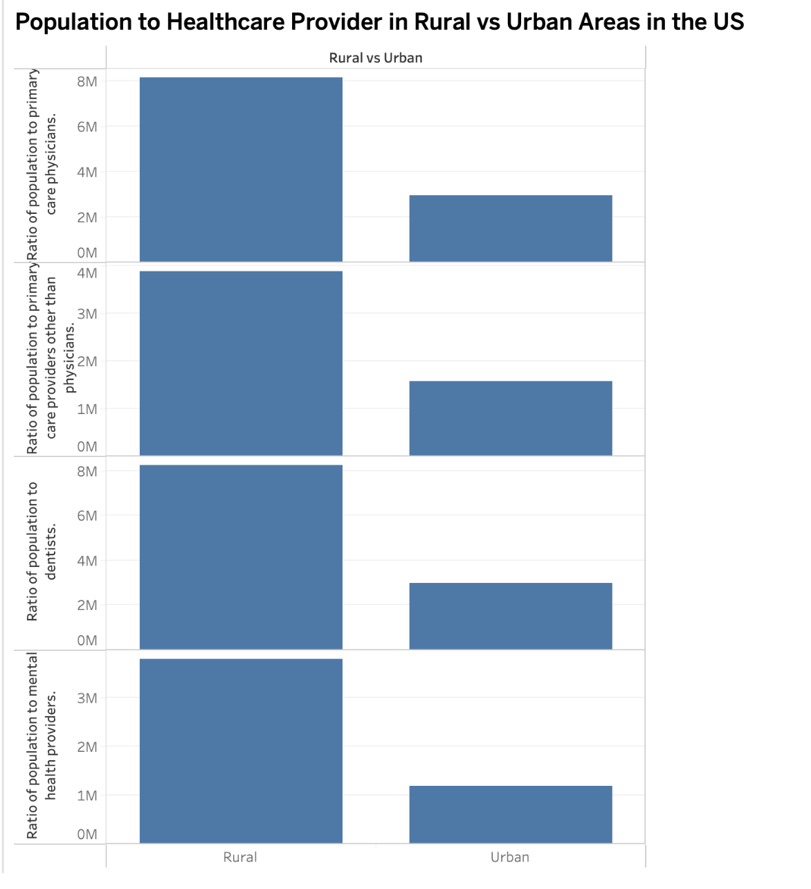
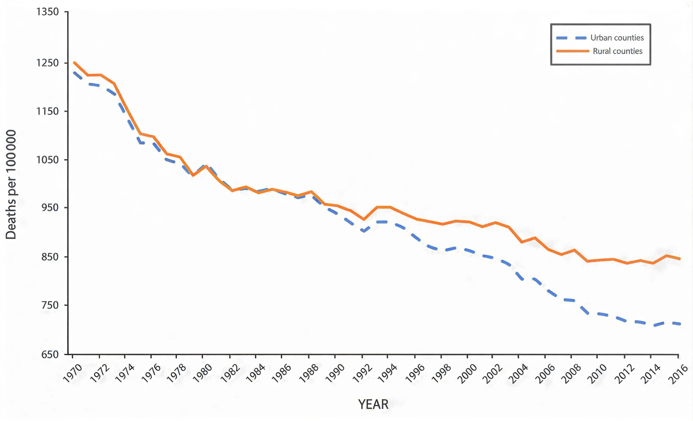

---

## Introduction

Healthcare disparities between rural and urban communities in the United States are widely acknowledged, but the scale, causes, and evolution of these differences are not clearly understood. This project uses different visualizations to explore how healthcare outcomes diverge across geography and over time. Our analysis focuses on three key questions:

- Where are the most heavily impacted regions?
- Why do rural communities experience worse health outcomes?
- How have these disparities evolved historically?

Our visualizations, including a heat map of premature death rates, trends in rural hospital closures, and a time-series analysis of lifespan divergence, show that rural communities consistently experience higher mortality rates, reduced healthcare access, and slower improvements in life expectancy.

---

## Premature Deaths Are Concentrated in Rural America:

<noscript></noscript>
<object class="tableauViz" style="display: none">
<param name="host_url" value="https://public.tableau.com/" />
<param name="embed_code_version" value="3" />
<param name="site_root" value="" />
<param name="name" value="6730Project_17752588786580/Sheet1" />
<param name="tabs" value="no" />
<param name="toolbar" value="yes" />
<param name="static_image"
value="https://public.tableau.com/static/images/67/6730Project_17752588786580/Sheet1/1.png" />
<param name="animate_transition" value="yes" />
<param name="display_static_image" value="yes" />
<param name="display_spinner" value="yes" />
<param name="display_overlay" value="yes" />
<param name="display_count" value="yes" />
<param name="language" value="en-US" />
<param name="filter" value="publish=yes" />
</object>

Health outcomes are not evenly distributed across the United States. While
many urban communities benefit from strong healthcare infrastructure and
lower mortality rates, rural areas can face a very different reality, where
higher rates of premature death are far more common.

This heat map reveals some clear geographic patterns, with the highest
premature death rates concentrated in rural regions, particularly across
the rural west. These patterns reflect deeper structural challenges,
including limited access to care, fewer providers, and greater
socioeconomic barriers. Even when comparing rural and urban counties
directly, rural areas consistently show worse outcomes.

Each shaded region reflects lives cut short and communities facing
preventable health risks. Together, these patterns reinforce a broader reality
where you live plays a significant role in how long you live.

---

## Rural Hospitals Are Disappearing and Access is Shrinking:

  <noscript
    ></noscript
  ><object class="tableauViz" style="display: none">
    <param name="host_url" value="https%3A%2F%2Fpublic.tableau.com%2F" />
    <param name="embed_code_version" value="3" />
    <param name="site_root" value="" />
    <param name="name" value="HospitalClosuresRuralvsUrban&#47;Sheet1" />
    <param name="tabs" value="no" />
    <param name="toolbar" value="yes" />
    <param
      name="static_image"
      value="https:&#47;&#47;public.tableau.com&#47;static&#47;images&#47;Ho&#47;HospitalClosuresRuralvsUrban&#47;Sheet1&#47;1.png"
    />
    <param name="animate_transition" value="yes" />
    <param name="display_static_image" value="yes" />
    <param name="display_spinner" value="yes" />
    <param name="display_overlay" value="yes" />
    <param name="display_count" value="yes" />
    <param name="language" value="en-US" />
    <param name="filter" value="publish=yes" />
  </object>

Access to healthcare is not equal across the United States. While urban communities generally have multiple hospitals and clinics within a short distance, millions of Americans living in rural areas are facing a drastically different reality where the nearest hospital may be hours away, or may no longer exist at all. Since 2005 195 rural hospitals across the United States have closed or converted their services, stripping rural communities of critical access to emergency care, inpatient services, and specialty medicine. These are not just statistics, each closure represents a community left without a safety net, where a heart attack or a complicated childbirth could now mean a life-threatening delay in care. The data used in this visualization comes from the UNC Cecil G. Sheps Center for Health Services Research, the most widely cited source for rural hospital closure tracking in the United States.

Financial pressure is the primary driver behind rural hospital closures, but the causes run deeper than balance sheets alone. Rural hospitals frequently serve populations that are older, poorer, and more likely to be uninsured or on Medicaid than their urban counterparts, making it harder to generate the revenue needed to stay operational. Low patient volume, aging infrastructure, and inadequate Medicare and Medicaid reimbursement rates have pushed hundreds of facilities to the brink. When a rural hospital closes, the effects ripple outwards. Jobs disappear, local economies weaken, and residents are left with impossible choices about where to seek care. Research has shown that communities that lose their only hospital experience measurable increases in mortality rates, reduced emergency response capabilities, and long-term economic decline that can last for decades.

The interactive chart above breaks down hospital closures by two categories: rural hospitals located in or near urban metro areas, and those in the most remote and isolated rural communities. By comparing these two groups over time, a clear pattern emerges, closures have not been evenly distributed even within rural America. The most isolated communities have faced higher rates of hospital loss, compounding already serious challenges around healthcare access, transportation, and provider shortages. Use the state dropdown to explore how these trends have played out in specific states, and to see which regions have been hit hardest over the past two decades.

---

## Rural Areas Have Fewer Primary Care Providers Per Person Than Urban Areas:

  

The population-to-provider ratio highlights disparities in access to primary care across the United States. Rural areas have significantly higher ratios than urban areas, meaning each doctor serves more people. This indicates fewer available providers per person and makes it harder for rural residents to access timely and preventive care. In contrast, urban areas benefit from a higher concentration of providers, allowing for more accessible and consistent healthcare services.

---

## Rural and Urban Life Expectancy is Splitting Apart:

  

Most Americans already know that rural communities face worse health
outcomes. But this chart shows that it wasn’t always this way.

For much of the late 20th century, urban and rural mortality rates moved
closely together, falling at nearly the same pace. The gap was almost easy
to overlook. Around the 1990s, the lines begin to separate with urban
areas continuing to improve. Rural areas slow down, then stall. What was
once a narrow difference turns into a clear and persistent divide.

This shift suggests the problem isn’t something fixed or inevitable about
rural places, it is something that developed over time. Key moments and
policy changes like the Balanced Budget Act, expansions under the
Affordable Care Act, or shocks like COVID frame where that separation
accelerates.

Alongside the other visuals, a wider perspective reveals this isn’t just a
known issue, but a growing one. What began as a small difference slowly
snowballs over time. Each year adds a little more distance, reflecting
differences in access, resources, and how far the healthcare system
reaches.

---

## Why are Rural Health Outcomes Worse?:

Several structural factors drive worse outcomes in rural areas:

- Fewer healthcare providers per capita
- Longer travel distances to hospitals
- Higher uninsured or underinsured populations
- Older population demographics
- Lower income and higher poverty rates
  These factors compound over time, creating systemic disadvantages in access and care.

---

## When Did the Gap Start Growing?:

Some events that shaped this divide include:

- 1997 – Balanced Budget Act reduces rural hospital funding
- 2010 – Affordable Care Act expands coverage unevenly across states
- 2020 – COVID-19 intensifies disparities in already vulnerable regions

---

## What This Means for People:

In rural communities:

- Emergency response times can be significantly longer
- Patients may travel hours for basic care
- Preventable conditions become life-threatening
  This is a reflection on the differences in survival and quality of life between rural and urban communities.

---

## Rural vs Urban Snapshot:

- Higher premature death rates in rural counties
- Fewer hospitals and providers per capita
- Slower improvements in life expectancy
- This is a gap that is consistent across multiple measures.

---

## What Happens Next?:

If current trends continue, rural communities may face:

- Increasing hospital closures
- Widening life expectancy gaps
- Greater strain on remaining healthcare systems
  Addressing these disparities will require targeted policy and investment in rural healthcare infrastructure.

---

## Key Takeaways:

- Rural health disparities are real and growing
- The gap has widened significantly since the 1990s
- Hospital closures and access barriers play a major role
- Without intervention, disparities will continue to expand

---

## Conclusion

This project highlights a growing disparity in healthcare quality between
rural and urban communities. Through visualization, we can better
understand where and why these gaps exist and why they continue to expand.

---
